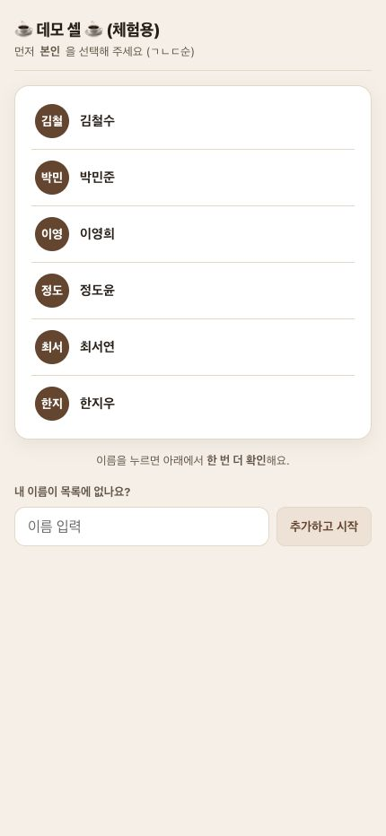
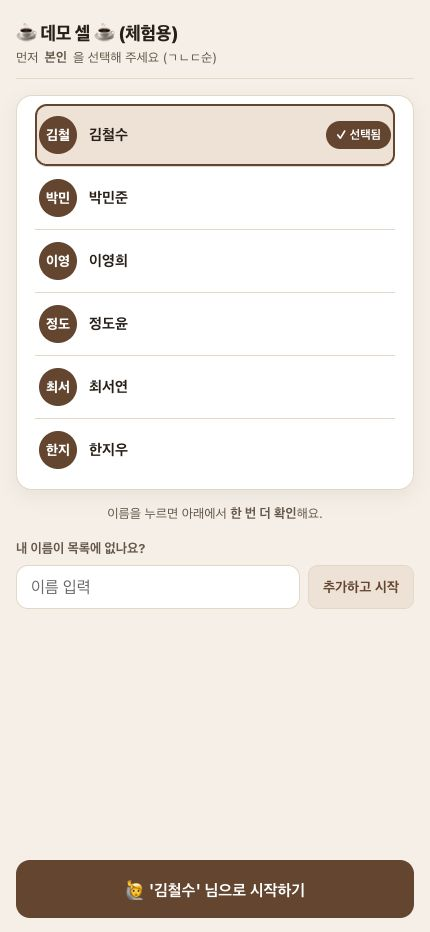
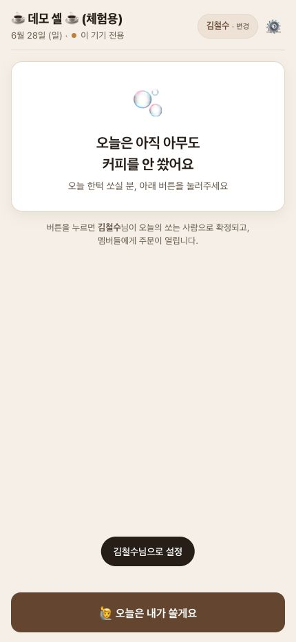
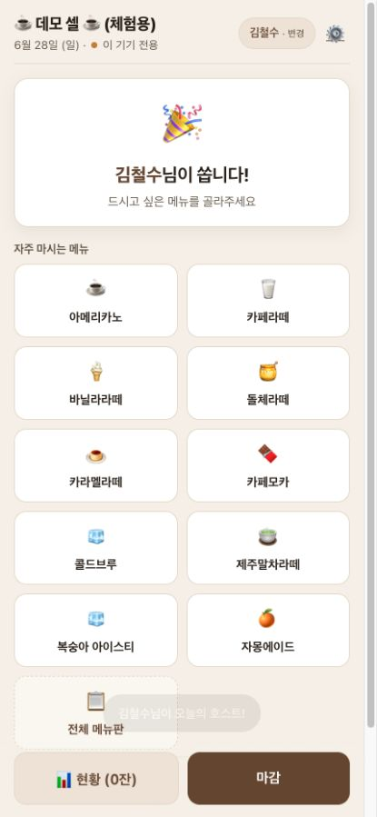
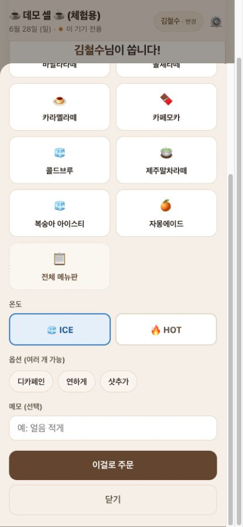
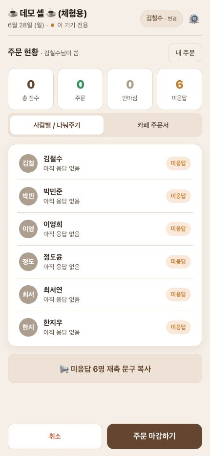

# 오늘은 제가 섬기겠습니다 사용법

대상 URL: https://haseong23.github.io/let-me-know-your-menu/?cell=demo

시크릿 모드처럼 처음 들어온 사용자를 기준으로 정리했습니다. 실제 공유 데모 데이터 변경을 피하기 위해 주문 제출과 마감은 누르지 않았고, 주최자 시작 화면은 같은 앱을 로컬 테스트 환경에서 재현해 캡처했습니다.

## 1. 내 이름을 고릅니다

링크에 들어오면 셀 멤버 목록이 보입니다. 본인 이름을 누릅니다.

이름이 없으면 아래 입력칸에 이름을 적고 `추가하고 시작`을 누릅니다.

## 2. 선택한 이름을 한 번 더 확인합니다

선택 표시가 붙으면 아래의 `... 님으로 시작하기` 버튼을 누릅니다. 이 단계는 다른 사람 이름으로 주문하는 실수를 줄이기 위한 확인 단계입니다.

## 3. 오늘 주문을 엽니다

아직 아무도 주문을 열지 않았다면 `오늘은 내가 쏠게요` 버튼이 보입니다. 이 버튼을 누르면 내가 오늘의 주최자로 설정되고, 멤버들이 메뉴를 고를 수 있습니다.

이미 누군가 주문을 열어둔 상태라면 이 화면 없이 바로 메뉴 선택 화면으로 들어갑니다.

## 4. 메뉴를 고릅니다

자주 마시는 메뉴에서 원하는 음료를 누릅니다. 원하는 메뉴가 없으면 `전체 메뉴판`을 눌러 찾습니다.

오늘 마시지 않는 사람은 `오늘은 안 마실게요`를 누르면 됩니다.

## 5. 옵션을 정하고 주문합니다

`ICE` 또는 `HOT`을 고르고, 디카페인, 연하게, 샷추가 같은 옵션을 선택합니다. 요청사항이 있으면 메모에 적은 뒤 `이걸로 주문`을 누릅니다.

## 6. 현황을 확인합니다

주최자는 `현황`에서 총 잔수, 주문 완료, 안 마심, 미응답 인원을 확인합니다.

필요하면 미응답자 재촉 문구를 복사하고, 주문이 끝나면 `주문 마감하기`를 누릅니다.

## 한 줄 요약

이름 선택 → 이름 확인 → `오늘은 내가 쏠게요` → 메뉴 선택 → 옵션 선택 → `이걸로 주문` → 현황 확인
